# Praktikum-7
## Variable PHP
Menambahkan Variable pada program menggunakan PHP dengan menggunakan code dibawah ini untuk menambahkan variable pada program.
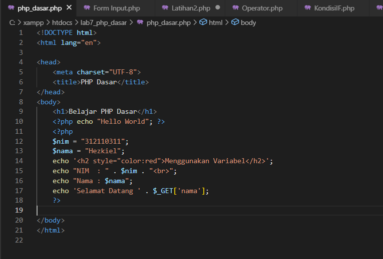
 

Hasil yang ditampilkan Program
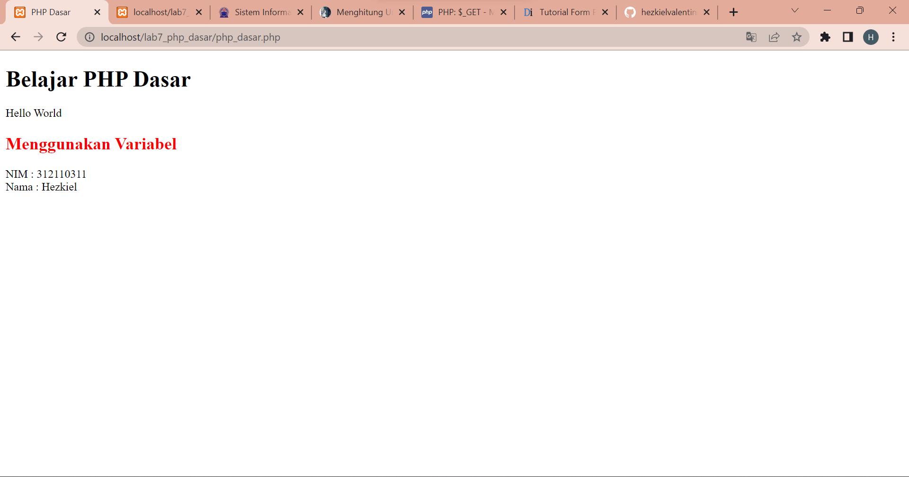
 

## Predifine Variable $_GET
Pertama buat file php seperti gambar dibawah ini.
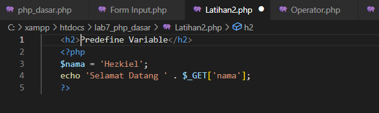w
 

Cara untuk mengakses program yang kita buat buka url http://localhost/lab7_php_dasar/Latihan2.php?nama=Hezkiel pada bagian Latihan2 di sesuaikan dengan nama file yang tadi kita buat, gunakan nama yang di inginkan pada bagian terakhir url dan hasilnya akan seperti ini.
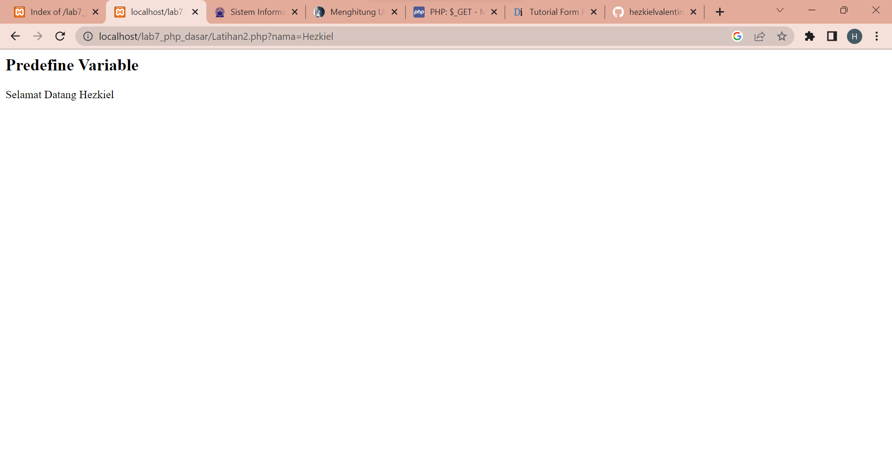
 

## Form Input
form Input berfungsi untuk memasukan data pada program dan ditampilkan oleh program. Untuk membuat form input bisa mengikuti seperti gambar dibawah berikut.
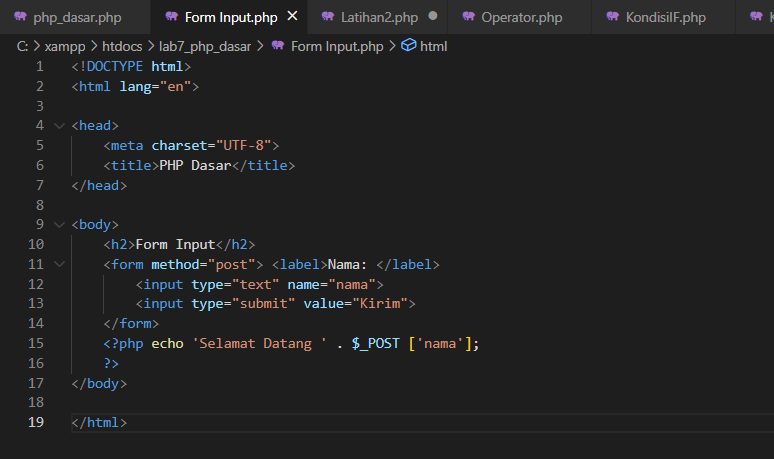
 

Hasil yang ditampilkan oleh program pada form input.
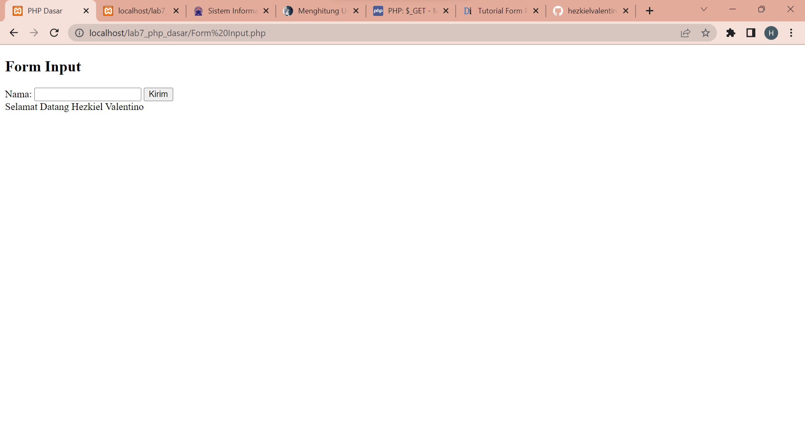
 

## Operator
Operator berfungsi untuk menghitung sebuah data pada program dengan contoh seperti gambar dibawah berikut.
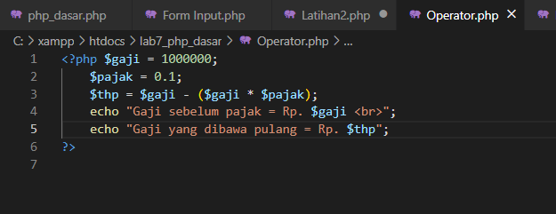
 

Hasil penghitungan program langsung ditampilkan seperti berikut.
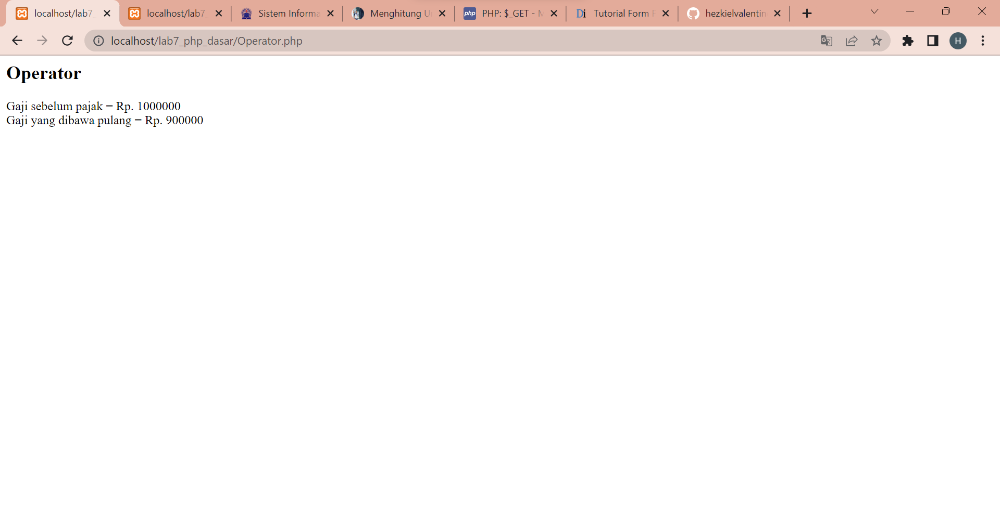
 

## Kondisi IF
Kondisi IF dilakukan disaat hanya ada satu tindakan yang dapat dilakukan, kondisi yang dibuat sebagai contoh untuk menentukan hari seperti gambar berikut.
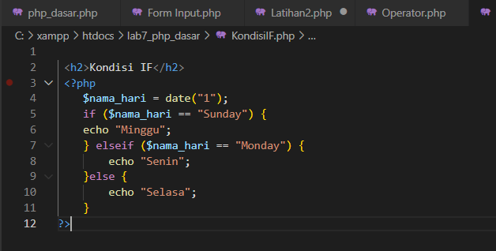
 

Hasil yang ditampilkan program
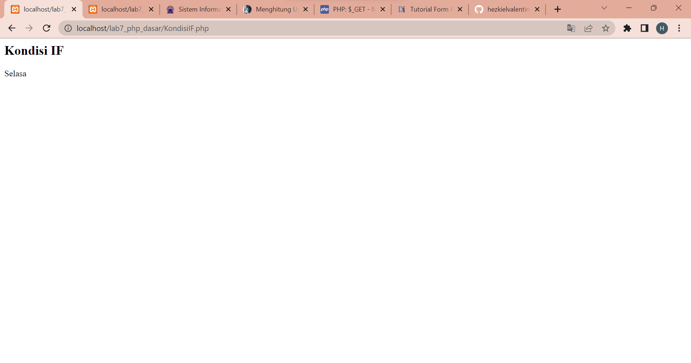
 

## Kondisi Switch
Kondisi Switch digunakan untuk memeriksa kebenaran suatu nilai dengan memiliki banyak pemilihan atau nilai pengeceknya. Untuk contohnya bisa menggukan gambar dibawah ini.
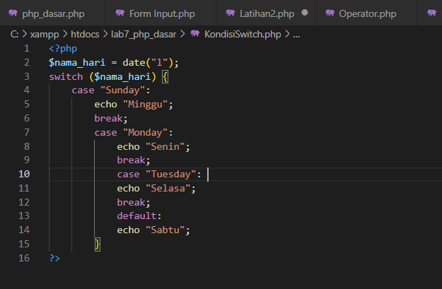
 

Hasil yang ditampilkan Program
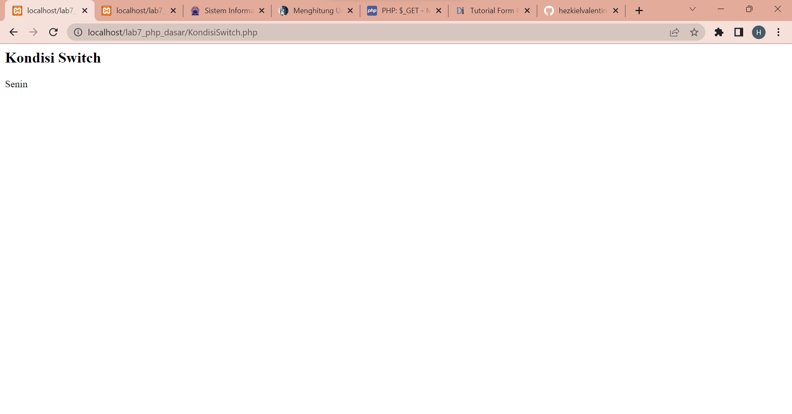
 

## Perulangan For
Perulangan For digunakan untuk membuat sebuah perulangan pada pemograman termasuk dalam bahasa pemograman PHP.
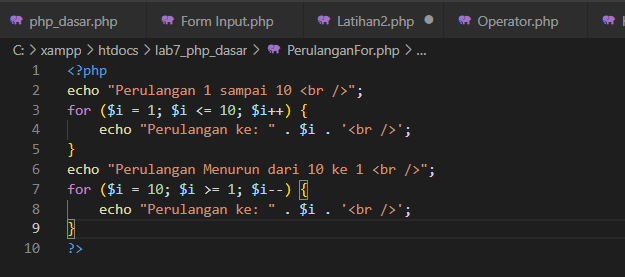
 

Hasil yang ditampilkan Program
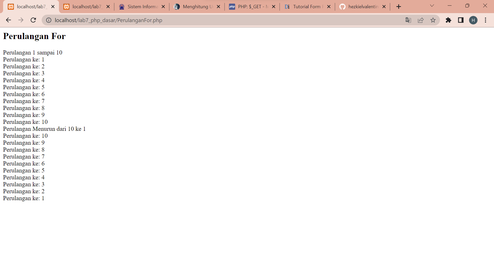
 

## Perulangan While
Perulangan While digunakan untuk membuat seuah perulangan yang tidak di ketahui berapa kali perulangan tersebut di lakukan. Untuk contoh seperti gambar dibawah ini.
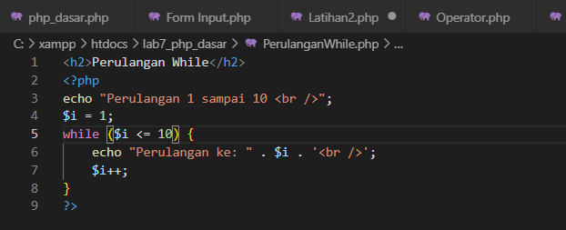
 

Hasil yang ditampilkan Program
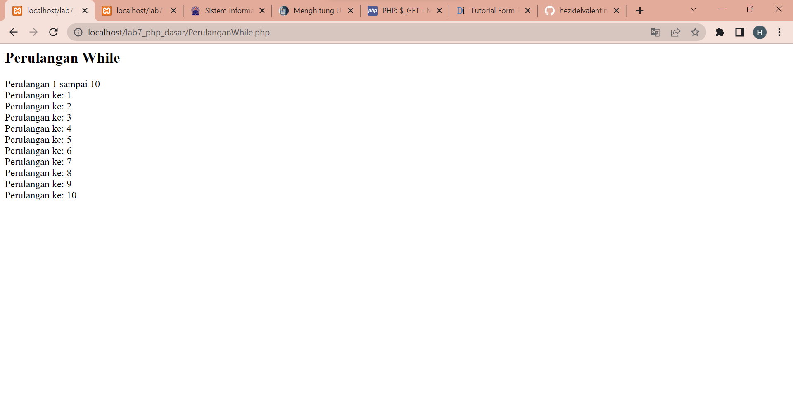
 

## Perulangan Do While
Perulangan do while di php adalah pengulangan statement yang dieksekusi setidaknya satu kali terlebih dulu dan kemudian berulang kali atau berhenti, tergantung pada kondisi yang diberikan di akhir blok program. Untuk contoh seperti gambar dibawah berikut.
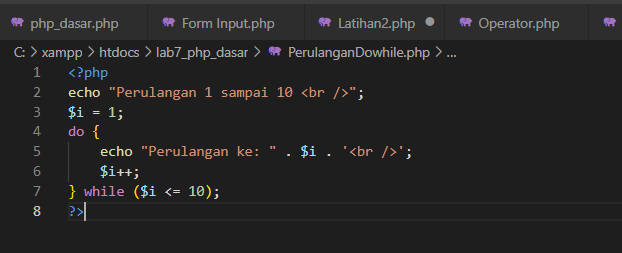
 

Hasil yang ditampilkan Program

--SELESAI--